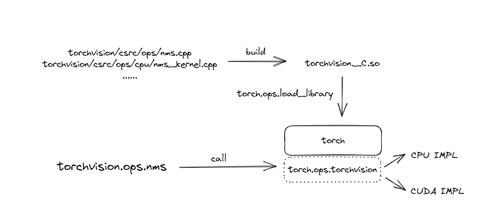
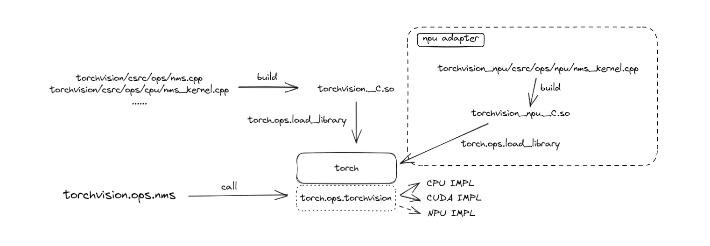

# Torchvision Adapter插件适配指导

-   [适配原则]()
-   [图像处理后端支持扩展]()
-   [图像读取适配]()
-   [图像处理适配]()
-   [算子适配]()

## 适配原则

- Torchvision Adapter插件为Torchvision在NPU硬件场景下适配框架。
一方面该框架提供Torchvision所实现算子的NPU实现，另一方面该框架可以借助NPU进行图像处理功能以提供加速。
- Torchvision的适配原则如下：
  1. 非侵入式修改，在适配框架中修改而不是直接在原仓库中进行修改。
  2. 尽可能做到上层无感，使得调用方在尽可能少修改代码的情况下能够适配。

## 图像处理后端支持扩展

原生Torchvision在区别图像处理后端时，使用了`image_backend`后端参数来控制图像处理所用后端。

```python
# torchvision_npu/__init__.py

_image_backend = "npu"

def set_image_backend(backend):
    global _image_backend
    if backend not in ["PIL", "accimage", "npu", "cv2"]:
        raise ValueError(f"Invalid backend '{backend}'. Options are 'npu', 'PIL' , 'cv2' and 'accimage'")
    _image_backend = backend
    print('transform backend: ', torchvision.get_image_backend())
    if torchvision.get_image_backend() == 'cv2':
        print('If you use the cv2 backend, must install opencv-python already and the input must be np.ndarray, '
              'otherwise an exception will be thrown.')


def get_image_backend():
    return _image_backend
```

## 图像读取适配

1. `default_loader`适配。

    在 `folder.py` 中重新定义 `default_loader`：
    ```python
    # torchvision_npu/datasets/folder.py
    
    def default_loader(path: str) -> Any:
        from torchvision import get_image_backend
    
        if get_image_backend() == 'npu':
            return _npu_loader(path)
        elif get_image_backend() == 'cv2':
            return _cv2_loader(path)
        elif get_image_backend() == "accimage":
            return fold.accimage_loader(path)
        else:
            return fold.pil_loader(path)
    ```
   
    monky-patch原有实现：
    ```python
    # torchvision_npu/datasets/folder.py
    def add_dataset_imagefolder():
        torchvision.datasets.DatasetFolder = DatasetFolder
        torchvision.datasets.ImageFolder = ImageFolder
    ```

2. 通过monky-patch数据集的`__get_item__`方法实现。

## 图像处理适配

Torchvision在`torchvision/transforms`路径下提供了图像处理的一些基本方法，其目录结构如下：

   ```shell
   transforms/
        ├── functional_pil.py
        ├── functional.py               # 屏蔽后端实现，将调用转发到PIL或者tensor
        ├── functional_tensor.py
        ├── transforms.py               # 对外提供接口，调用functional.py
        └── ...
   ```

通过简单分析能够发现，transforms部分设计逻辑便为：
`transforms.py`是对外呈现的表现层，调用`torchvision.transforms.functional`中定义的函数，
`torchvision.transforms.functional`是具体实现的分发层，
将调用分发到具体实现的`torchvision.transforms.functional_xx`模块中。

由于原生分层较为清晰，故在适配transforms部分时也较为简单。
首先在`torchvision_npu/transforms`文件夹下增加`functional_npu.py`，定义需要适配的图像处理的npu实现；
然后重写并monky-patch部分需要适配的`functional.py`内容，非必须情况下，对外呈现层`transforms.py`不做monkey-patch。

例如：

```python
# torchvision/transforms/transforms.py

class RandomHorizontalFlip(torch.nn.Module):

    def __init__(self, p=0.5):
        super().__init__()
        self.p = p

    def forward(self, img):
        if torch.rand(1) < self.p:
            return F.hflip(img)
        return img

    def __repr__(self):
        return self.__class__.__name__ + '(p={})'.format(self.p)
```

```python
# torchvision_npu/transforms/functional.py

from torchvision.transforms import functional_tensor as F_t
from torchvision.transforms import functional_pil as F_pil
from . import functional_npu as F_npu

def hflip(img: Tensor) -> Tensor:
    if not torch.jit.is_scripting() and not torch.jit.is_tracing():
        _log_api_usage_once(hflip)

    if not isinstance(img, torch.Tensor):
        return F_pil.hflip(img)

    if img.device.type == 'npu':
        _assert_image_npu(img)
        return F_npu._hflip(img)

    return F_t.hflip(img)

```

```python
# torchvision_npu/transforms/functional_npu.py

def _hflip(img: Tensor) -> Tensor:
    if torch.npu.is_jit_compile_false():
        return torch.ops.torchvision._horizontal_flip_aclnn(img)
    return torch.ops.torchvision._reverse_aclop(img, axis=[3])
```

## 算子适配

**表 1**  NPU支持算子列表

| 算子            | 是否支持 |
|---------------|------|
| nms           | √    |
| deform_conv2d | √    |
| ps_roi_align  | -    |
| ps_roi_pool   | -    |
| roi_align     | √    |
| roi_pool      | √    |

原生Torchvision的算子适配是将cuda/cpu算子以C++语言的方式进行编写，编译为so库；在加载Torchvision库的时候用`torch.ops.load_library(lib_path)`载入该so库;在做Torchvision Adapter插件的适配时，考虑沿用原生实现，增加npu实现方案。

1. 原生实现分析

    Torchvision关于算子完整框架代码存在于`torchvision/csrc/ops`目录下，其目录结构如下：
    ```
    torchvision/csrc/ops
                    │  nms.cpp
                    │  nms.h
                    │  ...
                    │
                    ├─autocast
                    │      nms_kernel.cpp
                    │      ...
                    │
                    ├─autograd
                    │      ...
                    │
                    ├─cpu
                    │      nms_kernel.cpp
                    │      ...
                    │
                    └─cuda
                            cuda_helpers.h
                            nms_kernel.cu
                            ...
    ```

    下面以nms算子为例分析完整的实现逻辑。

    如下代码所示，`torchvision/csrc/ops/nms.cpp`中定义了算子分发逻辑,算子作为插件附加到torch.ops.torchvision.nms中：

    ```C++
    // torchvision/csrc/ops/nms.cpp

    namespace vision {
    namespace ops {

    at::Tensor nms(
        const at::Tensor& dets,
        const at::Tensor& scores,
        double iou_threshold) {
    static auto op = c10::Dispatcher::singleton()
                        .findSchemaOrThrow("torchvision::nms", "")
                        .typed<decltype(nms)>();
    return op.call(dets, scores, iou_threshold);
    }  

    TORCH_LIBRARY_FRAGMENT(torchvision, m) {
    m.def(TORCH_SELECTIVE_SCHEMA(
        "torchvision::nms(Tensor dets, Tensor scores, float iou_threshold) -> Tensor"));
    }   // 此处定义 torch.ops.torchvision.nms ，并且该函数的入参和返回值

    } // namespace ops
    } // namespace vision
    ```
   
    再以CPU实现为例分析算子侧实现，CUDA算子实现同理。
    文件`torchvision/csrc/ops/cpu/nms_kernel.cpp`的`nms_kernel`函数中定义了nms算子的CPU实现，
    后通过`TORCH_LIBRARY_IMPL(torchvision, CPU, m)`宏确认nms算子的CPU实现。

    ```C++
    // torchvision/csrc/ops/cpu/nms_kernel.cpp

    at::Tensor nms_kernel(
    const at::Tensor& dets,
    const at::Tensor& scores,
    double iou_threshold) {
        ...
    }

    TORCH_LIBRARY_IMPL(torchvision, CPU, m) {   //绑定torch.ops.torchvision.nms的CPU实现为nms_kernel
    m.impl(TORCH_SELECTIVE_NAME("torchvision::nms"), TORCH_FN(nms_kernel));
    }

    ```

    Torchvision接口调用对外呈现为`torchvision.ops.nms`，实际上时在内层又是调用了`torch.ops.torchvision.nms`，其调用关系如下所示：

    


2. 适配分析

    在Torchvision Adapter插件中对算子进行适配时其实现较为简单，具体而言分为以下几点：

   1. 在`torchvision_npu/csrc/ops/npu`文件夹下新增npu算子实现，如`nms_kernel.cpp`，示例代码如下：
        ```C++
        namespace vision {
        namespace ops {

        at::Tensor nms_kernel(
            const at::Tensor& dets,
            const at::Tensor& scores,
            double iou_threshold) {
            // 具体实现
        }

        TORCH_LIBRARY_IMPL(torchvision, XLA, m) {   //绑定torch.ops.torchvision.nms的NPU实现为nms_kernel
        m.impl(TORCH_SELECTIVE_NAME("torchvision::nms"), TORCH_FN(nms_kernel));
        }

        } // namespace ops
        } // namespace vision

        ```

    2. 在打包文件setup.py中配置ext_modules参数，将`torchvision_npu/csrc/ops/npu/*.cpp`编译至`torchvision_npu._C`模块中；

    3. 在torchvision_npu的init函数中，使用`torch.ops.load_library(lib_path)`将`torchvision_npu._C.so`加载至Torch框架；

    4. 在NPU设备执行完成`import torchvision`和`import torchvision_npu`后，调用 `torchvision.ops.nms` 或 `torch.ops.torchvision.nms` 便可自动调用到NPU实现的nms算子。

    


3. 适配注意事项

    Torchvision需要使用在npu设备编译的whl包，否则在NPU上，torch将无法正常加载`torchvision._C.so`和`torchvision_npu._C.so`这两个二进制库。
